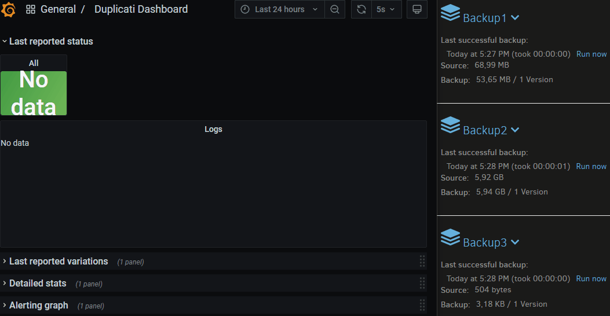
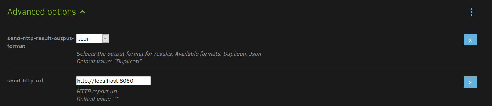

# Duplicati Dashboard

Duplicati Dashboard is a monitoring solution for [Duplicati](https://www.duplicati.com/).

It allows you to monitor your backups status, collects stats for each reports and alerts you by email when a backup fails. It is intended to be self-hosted and works with [docker-compose](https://docs.docker.com/compose/).

Everything is already pre-configured and ready to be deployed.

- [Duplicati Dashboard](#duplicati-dashboard)
- [Demo](#demo)
- [Quick Start](#quick-start)
    - [Running with docker-compose](#running-with-docker-compose)
    - [Setup Duplicati](#setup-duplicati)
    - [Connect to your dashboard](#connect-to-your-dashboard)
- [Configuration](#configuration)
  - [Env file](#env-file)
- [Notes](#notes)
  - [Grafana configuration locked](#grafana-configuration-locked)
  - [Backup over more than 30 days rotation](#backup-over-more-than-30-days-rotation)
  - [Alerting graph](#alerting-graph)
  - [Deleting removed backup data](#deleting-removed-backup-data)
  - [Docker-compose](#docker-compose)
- [Other informations](#other-informations)
- [License](#license)

# Demo


# Quick Start
### Running with docker-compose

```bash
git clone https://github.com/fabien-github/duplicati_dashboard.git
cd duplicati_dashboard
docker-compose up -d
```

### Setup Duplicati
Add theses two options for each backup you want to monitor:
- **send-http-result-output-format:** json
- **send-http-url:** http://localhost:8080



> This assumes that your Duplicati instance is on the same host as your Duplicati Dashboard.

### Connect to your dashboard

http://localhost:3000

Login: `admin` Password: `password`

> For email alerting, you need to configure a SMTP relay. See [Configuration > Env file](#env-file)

# Configuration
## Env file

The file [`config.env`](config.env) is used to configure some options. It will be shared between the 3 containers.

Only use this default configuration for testing purposes.

Influxdb variable will create and setup the database only on the first startup.

| Variables | Default | Description |
| - | - | - |
| DOCKER_INFLUXDB_INIT_MODE |setup| [Automatically bootstrap the system](https://github.com/docker-library/docs/blob/master/influxdb/README.md#automated-setup)
|DOCKER_INFLUXDB_INIT_USERNAME|telegraf_user| Influxdb superadmin user
|DOCKER_INFLUXDB_INIT_PASSWORD|telegraf_password| Influxdb superadmin password
|DOCKER_INFLUXDB_INIT_ORG|telegraf_org| Influxdb Organization (used by influxdb / telegraf / grafana)
|DOCKER_INFLUXDB_INIT_BUCKET|telegraf| Influxdb bucket to store reports (used by influxdb / telegraf / grafana)
|DOCKER_INFLUXDB_INIT_ADMIN_TOKEN|telegraf_token| Influxdb superadmin token (used by influxdb / telegraf / grafana)
|DOCKER_INFLUXDB_INIT_RETENTION|| Influxdb data retention, default will retain forever
|INFLUXD_REPORTING_DISABLED|false| Disable [InfluxData telemetry](https://docs.influxdata.com/influxdb/v2.0/reference/config-options/#reporting-disabled)
|TELEGRAF_LISTENER_PORT|8080|Port used by [http_listener_v2](https://github.com/influxdata/telegraf/tree/master/plugins/inputs/http_listener_v2) input, endpoint for the reports sent by Duplicati
|TELEGRAF_LISTENER_PATH|/| Path to listen to
|GF_SECURITY_ADMIN_USER|admin|Grafana superadmin user
|GF_SECURITY_ADMIN_PASSWORD|password|Grafana superadmin password
|GF_SERVER_ROOT_URL|http://localhost:3000|Grafana URL, used in some templates like email notifications
|GF_DASHBOARDS_DEFAULT_HOME_DASHBOARD_PATH|/etc/grafana/provisioning/dashboards/duplicati_dashboard.json|Force Duplicati dashboard by default on home page
|GF_SMTP_ENABLED|false|[Set to true for email notifications](https://grafana.com/docs/grafana/latest/administration/configuration/#smtp)
|GF_SMTP_HOST|localhost:25|SMTP relay server. [host]:[port]
|GF_SMTP_FROM_NAME|Grafana|Name of the email sender
|GF_SMTP_USER||In case of SMTP auth
|GF_SMTP_PASSWORD||In case of SMTP auth
|GF_SMTP_FROM_ADDRESS|admin@grafana.localhost|Address used when sending out emails
|GF_SMTP_EHLO_IDENTITY|${HOSTNAME}|Name to be used as client identity for EHLO in SMTP dialog (Default will be the container ID)
|GF_SMTP_STARTTLS_POLICY||“OpportunisticStartTLS”, “MandatoryStartTLS”, “NoStartTLS”
|NOTIFIER_EMAIL_RECIPIENT|example@example.com|Recipients for email notification (separated by a comma)
|NOTIFIER_EMAIL_REMINDER_ENABLE|true|Re-send an email if alerts are still active
|NOTIFIER_EMAIL_REMINDER_FREQUENCY|2h|Delay between email reminders

# Notes

## Grafana configuration locked

The dashboard is locked by the Grafana provisioning system. You can't edit the datasource, the dashboard or the alert notifier from the UI. You will need to copy the dashboard or disable the provisioning configuration.

Dashboard path: `./grafana/provisioning/dashboards/duplicati_dashboard.json`

The idea is to keep the stack easy to deploy for everyone without investing time to learn Grafana configuration.

Feel free to fork the project or directly edit files on your own.

More information [here](https://grafana.com/docs/grafana/latest/administration/provisioning/).

## Backup over more than 30 days rotation
- Grafana will discover your backups name from the reports but only over the last 90 days. So if your backups are scheduled for more than 90 days, you will need to edit the request of the variable `Backup` in the dashboard configuration:

```bash
from(bucket: v.defaultBucket)
  |> range(start: -90d)
  |> filter(fn: (r) => true)
  |> toString()
  |> group(columns: ["backup-name"])
  |> distinct(column: "backup-name")
  |> keep(columns: ["_value"])
```
  
- Last reported status / Last reported variations / Alerting graph are based over the past 30 days. You will need to adapt each panel requests if your backups are scheduled over more than 30 days.
```bash
import "influxdata/influxdb/schema"

from(bucket: v.defaultBucket)
  |> range(start: -30d)
  ...
```
## Alerting graph

The section "Alerting graph" is only used to trigger an alert when a backup fails. This is due to the lack of grafana alert support on other panel type. [#6983](https://github.com/grafana/grafana/issues/6983)

Backups status will be checked every minutes. An alert will be triggered after a pending status of 10min. Same delays are used on the recovery.

Warning reports don't trigger an alert.
## Deleting removed backup data

After getting inside the influxdb container:

```bash
influx delete \
  --org telegraf_org \
  --bucket telegraf \
  --token "telegraf_token" \
  --start 1970-01-01T00:00:00Z \
  --stop $(date +"%Y-%m-%dT%H:%M:%SZ") \
  --predicate '_measurement="duplicati" AND "backup-name"="backup_to_delete"'
```
## Docker-compose

- **Telegraf**: Receive JSON reports from Duplicati.

- **Influxdb**: Store reports converted by Telegraf.

- **Grafana**: Requests Influxdb to generate dashboard and alerts.

Telegraf endpoint provides a limited [HTTP autentification](https://github.com/influxdata/telegraf/tree/master/plugins/inputs/http_listener_v2).  
The configuration file is located here : `./telegraf/telegraf.conf`

Feel free to add a proxy like traefik or nginx to protect the stack on an unsecure network. (TLS, IP Restrictions, ...)
# Other informations

- Not sure of the scalabilty, requests to the database are not efficients. Timeseries databases are not really adapted for this kind of data. This is mainly due to the nested and uneven json format from the reports and the variation time between reports.
- Features are limited directly by the stack itself. For example, it's nearly impossible to add a managment system for the backups.
- This project has no link with the development of Duplicati and his team.

# License

Distributed under the GNU General Public License v3.0 License. See [LICENSE](LICENSE) for more information.